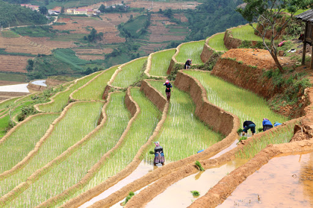

```{=html}
<!--
This is for including Chapter 1.  Notice that it's also good practice to name your chunk.  This will help you debug potential issues as you knit.  The chunk above is called intro and the one below is called chapter1.  Feel free to change the name of the Rmd file as you wish, but don't forget to change it here from chap1.Rmd.
-->
```
```{=html}
<!--
The {#rmd-basics} text after the chapter declaration will allow us to link throughout the document back to the beginning of Chapter 1.  These labels will automatically be generated (if not specified) by changing the spaces to hyphens and capital letters to lowercase.  Look for the reference to this label at the beginning of Chapter 2.
-->
```
```{r include=FALSE}
library(kableExtra)
library(dplyr)
library(tidyr)
library(tidyverse)
library(ggplot2)

```

<!-- Extras to make the refs in the captions work for PDF-->

(ref:googleimages) [@GoogleImages2021] (ref:terracerice) [@asiaaventuraTrekkingMuCang2021]

# Context {#Theory}

This chapter details the theoretical basis for this thesis. Initially, literature will be reviewed beginning with irrigation expansion drivers in Section \@ref(drivers) and followed by a detailed account of prior irrigation modeling studies in Section \@ref(irrmodslit). Finally, an account of the basics of Bayesian inference will be described in Section \@ref(bayesintro).

## Literature {#lit}

Foundations for the model proposed in this thesis begin at the literature level. In order to appropriately select predictors for the proposed model, it is necessary to look at what drives irrigation from multiple angles including studies on farmer preferences, policy decisions, manuals, reports, and other modeling studies.

### Drivers of Irrigation Expansion {#drivers}

Understanding the mechanisms behind irrigation and the features of irrigation systems is imperative to understanding why, when, and where irrigation is implemented. According to the @faoGuidelinesDesigningEvaluating1989, the choice by the farmer of irrigation technology is dependent on several intertwined socio-economic and biophysical concerns. Multitudes of literature exist detailing the considerations necessary when choosing an irrigation system, but little exists on why farmers choose to irrigate in the first place. Although the distinction is notable and directly equating the choice of a specific irrigation technology to the decision to begin irrigating is perhaps naive, it is important to understand that the decision to irrigate *is not possible* without the simultaneous choice of an irrigation technology. Therefore using the irrigation technology selection criteria outlined by @faoGuidelinesDesigningEvaluating1989 as a basis to discuss drivers of irrigation expansion is justified.

By using these areas as a guideline for what farmers are concerned about when establishing an irrigation system and why those concerns exist, not only can the causal relationship between external conditions and irrigation expansion be investigated, but appropriate predictors for the hierarchical model can also be selected. These eight components are detailed in the subsections below.

To begin, it is important to know a little bit about irrigation systems. Irrigation systems can be divided into two main systems: gravity fed which includes all types of surface irrigation, and mechanized pump systems, such as sprinkler or localized distributions [@bjornebergIRRIGATIONMethods2013]. Surface irrigation, such as furrow, basin, or border irrigation, is the oldest, simplest, and cheapest method available and used on around 85% of the irrigated land in the world [@bjornebergIRRIGATIONMethods2013; @holzapfelIrrigationAgriculture2008]. Pumped irrigation systems are less common globally. Different types of irrigation can be seen in Figure \@ref(fig:irrigationtypes).

```{r irrigationtypes, echo=FALSE,out.width="30%", out.height="20%",fig.cap="Furrow, Sprinkler and Drip irrigation  [@GoogleImages2021]",fig.show='hold',fig.align='center'}
knitr::include_graphics(c("figure/FurrowPic.jpeg","figure/Irrigation-sprinklers.jpeg", "figure/DripIrrigation.jpeg"))
```

#### Water {#water}

Water supply is a core component of irrigation and can be divided into two main dimensions, water quantity, and water quality. As water quality matters more for the choice of a specify irrigation technology, it will not be discussed in detail below. Water quantity, however, is a large concern when deciding if a farmer can irrigate. In the natural world, water comes from three sources: rain, surface water (rivers, lakes, reservoirs, etc.), or groundwater (aquifers).

Precipitation, specifically rainfall, is not technically an irrigation water source as is applied directly to crops without any irrigation system. As a result, rainfall, a free source of crop water, currently sustains roughly 80% of the global cultivated area which produces 60% of the total crop production [@worldwaterassesnentprogramUnitedNationsWorld2009]. Although direct rainfall is the predominant method for watering crops and can nullify the need for any irrigation technology, meeting crop water demand with rainfall can be difficult as rainfall can be extremely varied in both space and time. Spatially, different regions receive different annual amounts of rainfall, with tropical and temperate zones receiving more rainfall than semi-arid or arid regions [@forsethTerrestrialBiomes2010]. However, mean annual rainfall does not show the whole picture, and when deciding whether the amount of precipitation in a region is sufficient to sustain crop growth, it is important to remember that rainfall can heavily vary in seasonality, as well. Wet and dry seasons dictate the boom and bust of vegetation in some tropical and sub-tropical regions [CITATION]. The coincidence of rainfall and crop growing season is integral for farmers as crop water demands must be met during the specific periods of the crop's growing cycle. One benefit of rain-fed agriculture is that rainwater is naturally of high quality, meaning that it is free of solids and harmful substances that other water sources may have [@douglascoxWaterQualityCrop2015]. Although, it should be noted that patterns of rainfall are shifting with the effects of climate change. When long-standing climactic patterns change, differences in annual rainfall amounts, duration of the wet and dry seasons, and intensity of rainfall have consequences for both farmers and crops, making planning for a productive growing season more difficult in some areas [@rockstromManagingWaterRainfed2010]. These changes have the potential to incentivize the shift from rainfed agriculture to irrigated.

Surface water is only applied to crops through an irrigation system, unlike rainwater. Surface water is water that is collected, from precipitation, runoff, and up-welling of groundwater resources, on the surface of the planet (in rivers, lakes, ponds, and dams). Surface water is the most common water source for irrigation as its supply is generally less variable than precipitation and easier to access than groundwater. As a result, 54% of the area available for irrigation is irrigated with surface water [@siebertGroundwaterUseIrrigation2010; @thenkabailGlobalIrrigatedArea2009]. Surface water, due to the fact that it is accumulative, potentially passes through many environments before it is extracted by the farmer and applied to the field, meaning that issues with water quality are more common. Pollution, sediment, and salts must be monitored to ensure that the surface water can be applied to crops and is able to pass through the specific irrigation distribution system [@faoIrrigationManualPlanning2001]. Again, it should be pointed out that since the original source of most surface water is precipitation in some form, it is also susceptible to changes in precipitation patterns due to climate change.

Groundwater, water that is stored below ground in aquifers, is a collection of water that has infiltrated through the soil over many years. As a source of clean reliable irrigation water, groundwater is unparalleled [@siebertGroundwaterUseIrrigation2010]. The water stored in aquifers is of high quality and much more resistant to seasonal changes in precipitation than surface water. Groundwater's largest issue, with respect to its use as a source of water for irrigation, is access. Multiple methods for groundwater extraction exist but most are more costly than surface water withdrawals. However, in semi-arid or arid regions where surface water may also be seasonal or non-existent, extraction of groundwater for irrigation becomes more economically viable as its use can sustain large populations (E.g. regions in the middle east).

Ultimately, rainfall is always the default source for farmers to supply water to their crops, and only when rainfall is not sufficient during necessary parts of the crop growing season, do farmers consider using irrigation to meet the crop water demand.

#### Topography {#topo}

<!-- FOR GITBOOK -->

```{=html}
<style type="text/css">
  .figure {
    float: right;
    text-align: center;
  }
</style>
```
```{r fig.cap = "Terraced rice in Vietnam [@GoogleImages2021]", out.width = "50%", echo=FALSE}

```

Steep topography can prevent the implementation of the majority of most common and basic surface irrigation systems, such as furrow (using long channels to water crops) or basin (flooding of field sections) irrigation. Generally, for this type of irrigation to be used field slopes need to have less than a 5% incline, which limits the application of this simple type of irrigation to valleys and flatlands [@faoIrrigationManualPlanning2001].

<!--FOR PDF -->

<!-- \begin{wrapfigure}{r}{0.25\textwidth} -->

<!--   \begin{center} -->

<!--     \includegraphics[width=0.2\textwidth]{figure/TerraceRicePic.jpeg} -->

<!--   \end{center} -->

<!--   \caption{Terraced rice in Vietnam (ref:googleimages)} -->

<!-- \end{wrapfigure} -->

Other types of irrigation, sprinkler or localized systems, can be utilized in steeper environments, but are often more costly than simple surface irrigation techniques. There are some ingenious examples of farmers working with topography to use simple irrigation methods and adapt to steeper slopes: rice terraces in South East Asia use basin irrigation to cultivate paddy rice on extremely steep slopes [@adachiAgriculturalTechnologiesTerraced2007]. However, in general, steep slopes are rarely irrigated with surface irrigation methods.

#### Soil {#soil}

Soil composition, in the context of irrigation, is important because different soils have different capacities to store and infiltrate water, meaning that different types of irrigation systems may be necessary to ensure that crops are able to get the water that they need [@faoGuidelinesDesigningEvaluating1989]. For example, sandy soils retain less water and drain faster, meaning that they must be irrigated more frequently but with less water. In this case, surface irrigation methods that apply large amounts of water to a field at one time may be less suited for these soils [@faoIrrigationWaterManagement1986a]. In addition, as the soil type dictates the infiltration rate of irrigation water and therefore the rate of application, the soil type combined with the specific irrigation method chosen may impose requirements on the consistency and volume of the water supply. For the context of this thesis, soil composition will be largely ignored as the oftentimes soil composition limits the type of irrigation used, not the absence or presence of it. However, it is important to note that as surface irrigation methods, which are more common worldwide, are less suitable for certain soil types (E.g. sandy soils), there may be circumstances in which given a specific soil type, irrigation would be inefficient.

#### Crops {#crops}

Crop type also has the potential to influence the presence/absence of irrigation and the type used as different crops require different amounts of water over the the growing period [@faoIrrigationWaterManagement1986]. Staple crops that need to be irrigated are rarely irrigated with sprinkler or localized (drip) systems as these systems are much more costly than surface irrigation. Sprinkler and localized systems are almost always reserved for fruits and vegetables, so-called cash crops [@faoIrrigationWaterManagement1985].

#### Compatibility {#combatibility}

Irrigation technologies must be a benefit not a burden to the farmer and the choice to irrigate must fit within the given growing and harvesting needs of a particular crop. Irrigation must not impede the usage of pruning or harvesting machinery [@faoGuidelinesDesigningEvaluating1989]. In addition, the farmers must be able to work with the chosen irrigation technology. Sprinkler and localized systems are more complicated than surface irrigation, however, surface irrigation requires more manual input from the farmer. Surface irrigation is also easier to maintain than other types of irrigation [@faoIrrigationWaterManagement1986a]. This is less of a concern for this thesis, as compatibility issues between crop type, irrigation system, farmer knowledge, and other farm machinery is not the main focus.

#### Economics {#econ}

The economics of specific irrigation systems and the choice to irrigate is important for farmers, as even the simplest surface irrigation methods are not without costs. Water, energy, materials, labor, maintenance, and monitoring costs must all be considered when deciding to begin irrigating and which irrigation system to choose [@faoGuidelinesDesigningEvaluating1989]. According to @faoIrrigationManualPlanning2001, for small farms in Sub-Saharan Africa, up to 80% of the costs to develop an irrigation system stems from water resource procurement, such as construction of a dam. In addition, the authors note that the cost for cubic meter of water is increasing in this region as well, putting more economic pressure on the farmers.

#### Social Influences {#socinf}

However, there are ways to shift the costs of establishing irrigation from the individual farmer to the collective. Grass-roots, bottom-up irrigation cooperatives or schemes may be set up to share the construction, maintenance, and monitoring of shared irrigation and water transportation infrastructure [@faoGuidelinesDesigningEvaluating1989]. @faoGuidelinesDesigningEvaluating1989 note that there are often several levels involved in the organization of irrigation schemes. These include the individual farmers who participate at the field level; the local farmers' collectives who manage operation, maintenance, allocation, and conflicts; the governing body at the local or state level that deals with water distribution and funding. Each actor has different needs, power, and roles ensuring the management of local irrigation. Examples of irrigation schemes are common globally and historically.

#### External Influences {#extinf}

Sometimes external factors play a large role in stimulating irrigation expansion. Social trends, governmental programs, and conflicts among others can influence the rate of irrigation expansion at a sub-national, national, or regional level. This type of expansion could be labeled as top-down, as generally there are larger actors pushing or incentivising the construction of irrigation infrastructure, in comparison to the bottom-up dynamic of locally organized irrigation schemes.

@angelakisIrrigationWorldAgricultural2020 details explicitly some of these trends that have occurred during the last century. In Spain, during the reign of Francisco Franco [^1], the government began a national water development plan to settle small farmers. This campaign created the foundation for Spain's expansive irrigated agricultural system today, the largest irrigated area in the European Union. Another instance that @angelakisIrrigationWorldAgricultural2020 discusses is the sudden overall increase in irrigated area after the Second World War, which is attributed to two aspects: a sudden population increase and developments in technology. The population increase, due to increased birthrates and an extension of life span due to medical advances, created a demand for more food and advances in technology, specifically those that were necessary to optimize pumps needed for pressurized irrigation and water transportation systems. Both of these changes resulted in a rapid global expansion of irrigated area. Other examples exist such as the Green Revolution, or Third Agricultural Revolution [^2], also spurred trends of irrigation expansion, particularly in Asia [@angelakisIrrigationWorldAgricultural2020]. @angelakisIrrigationWorldAgricultural2020 points out that large scale irrigation projects often succeed due to governmental involvement and support from changing market patterns.

[^1]: A fascist dictator who ruled Spain from 1936-1975

[^2]: "A great increase in production of food grains (especially wheat and rice) that resulted from the introduction into developing countries of new, high-yielding varieties, beginning in the mid-20th century" [@britannicaGreenRevolution2020]

\bigskip

Ultimately, the drivers of irrigation are complex and interconnected. When quantifying these forces behind an ever changing pattern of irrigation it is easy to generalize, but the reality of irrigation is that there are infinite combinations of conditions, contexts, times, and ambitions that determine the ultimate success or failure of an irrigation project. What worked in one place and time, is not guaranteed to result in a positive outcome years later and worlds apart. The above sections are not exhaustive in their description of the complexity that is involved in the planning, construction, and operation of the majority of irrigation projects, but they are a good start.

\medskip

In the next section, a literature review of irrigation modeling studies will be described.

### Studies of Irrigation Expansion {#irrmodslit}

Shifting gears, there are few studies that investigate the drivers or irrigation expansion. Those that do, only one takes in to account historical data or detail expansion rates based on regions or countries. @siebertGlobalDataSet2015, after collecting a global dataset of historical irrigation patterns, goes on to investigate trends and patterns in global irrigation. The authors note that rates of irrigation expansion can be divided into two main time periods, before and after 1950, documenting that from 1900 to 1950 global irrigation doubled and from 1950 to 2005 global irrigated area tripled. Different regions also experienced different growth rates, with regions such as Australia and Oceania, southeastern Asia, Middle and South Africa, Central America, and eastern Asia experiencing growth rates higher than that of the global average and the North of Africa and North America, experiencing lower than average growth rates. Europe and Western Asia also stand out here with a slow decrease of area equipped for irrigation seen toward the end of the study period, confirming what @angelakisIrrigationWorldAgricultural2020 mentions regarding the disintegration of irrigation schemes after the dissolution of the USSR. In general @siebertGlobalDataSet2015 conclude that in 1900 irrigation took place predominately in arid locations, which expanded into more humid climes as the study period progresses, in fact, the percentage of global irrigation that occurred in arid regions remained relatively stable from 1900 to 2005, as where the percentage of global area equipped for irrigation went down in areas with rice cultivation and up in other wet areas. Ultimately, @siebertGlobalDataSet2015 connect changes in irrigation to several variables including population, aridity, and river discharge.

@neumannExploringGlobalIrrigation2011 attempt to model current irrigation patterns based on a variety of biophysical factors (slope, discharge, humidity, ET, evap, pop density, etc) and political factors (democracy, GDP, corruption, political stability) at two different levels, grid cell (5 arc-minute grid cells) and at a country level. However, Neumann's study is only modeling the current irrigation pattern, with no historical perspective. The authors find that the addition of socio-economic information to the model does help improve the explanation the current irrigation pattern, but not only to a small extent. A delay existed, as current patterns are formed from decisions, policies, and economic conditions that occurred years before.

@puyCurrentModelsUnderestimate2020 discuss uncertainties of published projected irrigation expansion patterns by comparing these projections to a simple model that predicts irrigated area as a function of only population size, bounded by available water and land. A simple model was constructed for ease of interpretation, as the main purpose of this study is to discuss uncertainties present in this (seemingly) simple model and investigate how other published projections of irrigation expansion fall within @puyCurrentModelsUnderestimate2020's model's range of uncertainty. @puyCurrentModelsUnderestimate2020's justification for modeling irrigated area as a function of only population size stems from the previous studies showing that population is a variable that encapsulates much more complicated socio-ecological relationships.

## Bayesian Inference {#bayesintro}

Bayesian inference has some unique features in comparison to other forms of statistical influence. For the context of this thesis the two main advantages or Bayesian Inference are an improved propagation of uncertainty throughout the modeling process and an ability to include prior information into models, allowing the inclusion prior knowledge [@gelmanRegressionOtherStories2020].

### Bayes Theorem {#bayesthe}

Bayes' theorem is the basis for Bayesian inference. Although Bayes' theorem can be manipulated in to many forms, the most basic representation is Equation \@ref(eq:bayesmath).

```{=tex}
\begin{equation}
p(\theta|y) = \frac{ p(y|\theta) * p(\theta)}{p(y)}
(\#eq:bayesmath)
\end{equation}
```
Where $\theta$ is an unknown parameter to be estimated and $y$ is the observed data. To understand the what is happening here, it is necessary to define some terms using accessible language from @mcelreathStatisticalRethinkingBayesian2020 [p. 37].

-   The symbol \| can be read as "given" or "conditional on", meaning that the probability of one event is dependent on the occurrence of another. This is also known ask "Conditional Probability".

-   The outcome $p(\theta|y)$, is also known as the "posterior" and can be read as "the probability of a the unobserved parameter given the observed data".

-   $p(y|\theta)$ is the probability of the data, or the likelihood.

-   $p(\theta)$, represents previous knowledge about the unobserved parameter $\theta$, and is called the "prior".

-   $p(y)$ is the "average probability of the data", which is "the probability of the data, that has been averaged over $p(\theta)$", as @mcelreathStatisticalRethinkingBayesian2020 [p. 37] mentions. The main function of $p(y)$ is to normalize the posterior (remember, $p(\theta|y)$).

All together Bayes' theorem looks like this [@mcelreathStatisticalRethinkingBayesian2020]:

```{=tex}
\begin{equation}
\text{Posterior} = \frac{\text{Probability of the Data} * \text{Prior}}{\text{Average Probability of the Data}}
(\#eq:bayesword)
\end{equation}
```
It is important to remember that although Bayes' theorem can be used with point estimates[^3], the advantage of Bayesian inference is that all terms in Equation \@ref(eq:bayesmath) can be represented as probability distributions, communicating much more uncertainty about a parameter than point estimate statistics. From this point forward, assume that terms such as posterior, prior, and likelihood imply distributions not point estimates. For fun, a relevant example of a point estimate use of Bayes Theorem is listed in Section \@ref(covidex).

[^3]: A point estimate is a single value, generally the average, given as the estimate value for a parameter.

Even more so when using probability distributions, often times it is difficult to deal with the normalizing term, $p(y)$. However, as $p(y)$ does not depend on the unobserved parameter $\theta$, it can be considered a constant and factored out giving rise to the more common used and less computationally difficult *unnormalized posterior density* [@mcelreathStatisticalRethinkingBayesian2020; @gelmanBayesianDataAnalysis2013]*.*

```{=tex}
\begin{equation}
p(\theta|y) \propto p(y|\theta) * p(\theta)
(\#eq:proppost)
\end{equation}
```
Effectively, Equation \@ref(eq:proppost) means that the posterior is proportional to the likelihood, $p(y|\theta)$, multiplied by the prior, $p(\theta)$. Its not necessary in most contexts to normalize using $p(y)$, proportionality works just fine.

#### The Prior

Specification of the prior distribution is not a trivial task, as the prior attempts to encapsulate the previous knowledge of a specific parameter and has impacts on the posterior distribution. The determination of the prior should be done before seeing the data and serves two main functions, communicating previous scientific or common knowledge about a parameters distribution and/or helping the the model learn more efficiently [@mcelreathStatisticalRethinkingBayesian2020]. Often times flat priors are used initially and improved upon iteratively. Effects of the prior on the posterior can be seen in Figure \@ref(fig:prioreffects) which is adapted from @mcelreathStatisticalRethinkingBayesian2020 [p. 38] and @kurzStatisticalRethinkingBrms2019 [sec. 2.4].

```{r warning=FALSE, message=FALSE, echo=FALSE}
sequence_length <- 1e3

d <-
  tibble(probability = seq(from = 0, to = 1, length.out = sequence_length)) %>% 
  expand(probability, row = c("flat", "beta", "exponential")) %>% 
  arrange(row, probability) %>% 
  mutate(prior = ifelse(row == "flat", 1,
                        ifelse(row == "beta", dbeta(probability, shape1 = 0.75, shape2 = 0.75),
                               dexp(probability, rate = 5))),
         likelihood = dnorm(probability, mean = 0.5, sd = 0.25)) %>% 
  group_by(row) %>% 
  mutate(posterior = prior * likelihood) %>% 
  gather(key, value, -probability, -row) %>% 
  ungroup() %>% 
  mutate(key = factor(key, levels = c("prior", "likelihood", "posterior")),
         row = factor(row, levels = c("flat", "beta", "exponential")))
```

```{r prioreffects, warning=FALSE, message=FALSE, echo=FALSE, fig.cap= "Effects of the prior distrubution on the unnormalized posterior with a Normal(0.5, 0.25) likelihood. First row: Uniform prior, Second row: Beta(a = 0.75, b = 0.75) prior, Third Row: Exponential prior. Prior and likelihood are multiplied together to create the unnormalized posterior seen in the third column."}
p1 <-
  d %>%
  filter(key == "prior") %>% 
  ggplot(aes(x = probability, y = value)) +
  geom_line() +
  scale_x_continuous(NULL, breaks = c(0, .5, 1)) +
  scale_y_continuous(NULL, breaks = NULL) +
  labs(subtitle = "prior") +
  theme(panel.grid       = element_blank(),
        strip.background = element_blank(),
        strip.text       = element_blank()) +
  facet_wrap(row ~ ., scales = "free_y", ncol = 1)

p2 <-
  d %>%
  filter(key == "likelihood") %>% 
  ggplot(aes(x = probability, y = value)) +
  geom_line() +
  scale_x_continuous(NULL, breaks = c(0, .5, 1)) +
  scale_y_continuous(NULL, breaks = NULL) +
  labs(subtitle = "likelihood") +
  theme(panel.grid       = element_blank(),
        strip.background = element_blank(),
        strip.text       = element_blank()) +
  facet_wrap(row ~ ., scales = "free_y", ncol = 1)

p3 <-
  d %>%
  filter(key == "posterior") %>% 
  ggplot(aes(x = probability, y = value)) +
  geom_line() +
  scale_x_continuous(NULL, breaks = c(0, .5, 1)) +
  scale_y_continuous(NULL, breaks = NULL) +
  labs(subtitle = "posterior") +
  theme(panel.grid       = element_blank(),
        strip.background = element_blank(),
        strip.text       = element_blank()) +
  facet_wrap(row ~ ., scales = "free_y", ncol = 1)

library(gridExtra)

grid.arrange(p1, p2, p3, ncol = 3)
```

There are several different types of priors used when discussing Bayesian inference. Some of the most common types of priors discussed are [@gelmanBayesianDataAnalysis2013]:

-   **Proper priors,** which integrate to 1 and **improper priors,** that don't. The fact that a prior (or any probability distribution for that matter) integrates to 1 is important not only computationally, as it makes it easier to manipulate and solve analytically, but an improper prior violates the assumption that probability distributions integrate to 1.

-   **Informative priors** communicate information about a given parameter's distribution, **non-informative priors** do not. A classic example of a non informative prior is a flat or uniform prior (seen in the row 1 of Section \@ref(fig:prioreffects)) as it assumes that all probability values are equally likely which is almost never the case.

-   To discuss the amount of information communicated via the prior distribution to the posterior, terms such as **Strongly Informative Priors** or **Weakly Informative Priors** can be used. Weakly informative priors are informative (i.e. they do contain information about the distribution of a given parameter) but serve to regularize the posterior only by setting bounds within which the posterior can vary its shape, meaning that they are not aiming to completely describe the distribution of a parameter. In addition, these priors are easily overwhelmed if the amount of data is large. Strongly informative priors, conversely, heavily influence the posterior distribution and are more likely to overwhelm the data.

The goal when specifying the prior is to have at least a weakly informative prior for each given parameter. This ensures that general scientific knowledge about the distribution of a parameter is communicated but if large amounts of data exist, the prior gives way to the overwhelming evidence of the likelihood [@gelmanPriorChoiceRecommendations2020]. Manipulation of the prior can be useful from can be used to solve or diagnose issues, given certain contexts and questions. However, it is important to note that "bad" (less suitable) priors can come with some unintended consequences such as allowing for more unstable predictions due sampling difficulties from bad geometry of the posterior (when using tools such as STAN [@standevelopmentteamRStanInterfaceStan2020]) or entertaining predictions that are not possible given the problem (ex. predicting negitive values when logically only positive ones exist) [@mcelreathStatisticalRethinkingBayesian2020[sec. 5.1]].

@gelmanPriorCanOften2017 and @gelmanPriorChoiceRecommendations2020 discuss appropriate prior choice and emphasize that the identification of weak or strong priors is not possible without knowledge of the likelihood, which violates the idea that a prior should be constructed *a priori,* or before having any notion of the data or even the data generating process. As mentioned in @gelmanPriorCanOften2017 [sec. 1.2], this may be the most ideal way to construct a prior but in reality practical concerns such as model convergence, unknown parameters, knowledge of the modeler, etc. make this task impossible or very difficult. Hence, a division is created that separates Bayesian issues into two camps, those can/are willing to build a prior in a *subjective* way by incorporating expert/scientific knowledge into the prior *before* seeing the data or setting up the model, and those that "break" this rule by using some knowledge about the likelihood and data to construct their prior.

Ultimately, prior specification for Bayesian inference is necessary but is often times more of an art than a science. Iterative processes help with choosing the prior and seeing its effect on the posterior for a given question, dataset, and model. The overall aim is to balance practical and theoretical concerns when choosing most the suitable prior. Currently, a large area of research focuses solely on prior specification and usage within a Bayesian context aimed at demystifying prior specification and increasing standardization of prior specification processes and documentation.

### Model Comparison Techniques

Several methods of model comparison exist for Bayesian models.

### Hierarchical Modeling

#### DAGs
